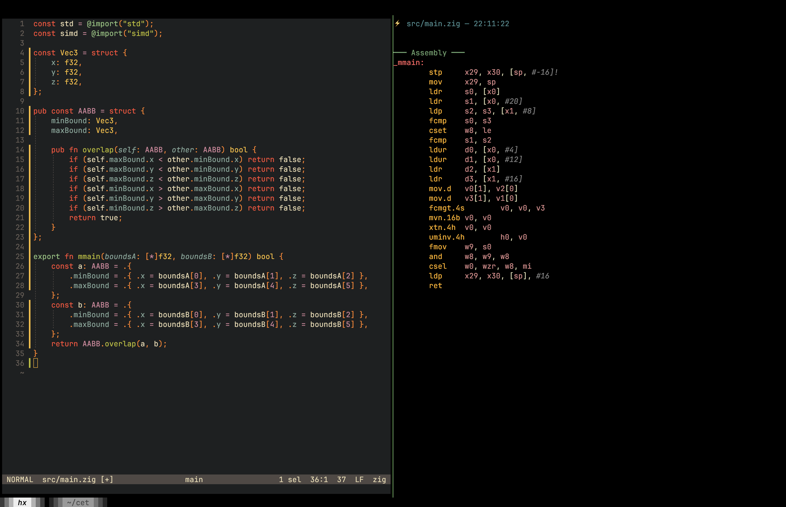

Compiler Explorer in the Terminal with file watching!

## Example Usage

```sh
cet --help
cet -args="-O ReleaseFast -target aarch64-macos -mcpu=apple_m4" src/main.zig
```



## Multi-File Projects

Multi-file compilation is supported. Use the `-root` flag to set the project root directory:

```sh
# Project where main.zig imports "src/utils.zig"
cet -root=. main.zig

# Compiling from a subdirectory
cet -root=/path/to/project src/main.zig
```

All source files matching the main file's extension are automatically collected and sent to Compiler Explorer.

## Limitations

### Module Aliasing Not Supported

Zig's build system allows renaming modules via `build.zig`:

```zig
// build.zig
const mod = b.addModule("hello", .{
    .root_source_file = b.path("src/root.zig"),
});
```

This lets code import by module name rather than path:

```zig
// main.zig
const hello = @import("hello");  // Works with `zig build`
```

**This tool cannot resolve aliased imports.** Since Godbolt doesn't execute `build.zig`, it has no way to know that `"hello"` maps to `src/root.zig`.

**Workarounds:**
- Use path-based imports: `@import("src/root.zig")` instead of `@import("hello")`
- Keep exploration code in a single file

## Future Plans

### CMake Support

A dedicated CMake endpoint exists at `POST /api/compiler/<compiler-id>/cmake`:

```json
{
  "source": "<CMakeLists.txt content>",
  "files": [
    {"filename": "main.cpp", "contents": "..."},
    {"filename": "utils.cpp", "contents": "..."},
    {"filename": "utils.hpp", "contents": "..."}
  ],
  "options": {
    "compilerOptions": {
      "cmakeArgs": "-DCMAKE_BUILD_TYPE=Release",
      "customOutputFilename": "myapp"
    }
  }
}
```

### Implementation Tasks

- For CMake projects: use the `/cmake` endpoint with `CMakeLists.txt` as the source
- Collect all `.cpp`, `.hpp`, `.h` files in the project directory
